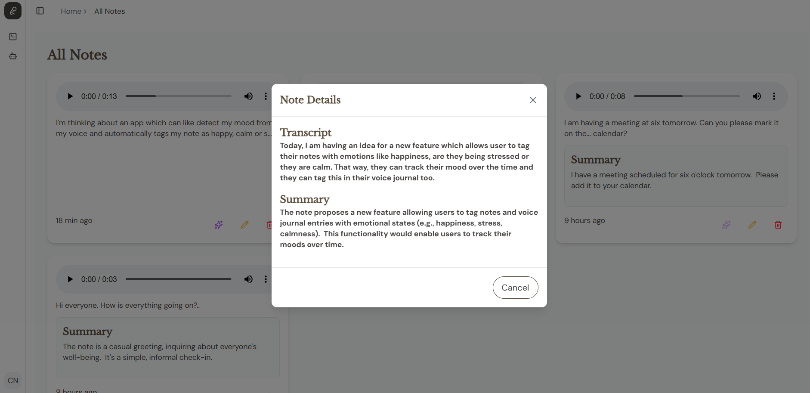

# 🎙️ Voice Journal App

A modern **Voice Notes Journal** built with React, Redux, Node.js, and Gemini AI.  
Record, store, and summarize your voice notes with a clean UI and Cloudinary integration for audio storage.  

---

## ✨ What Does This App Do?

This project is an **AI-powered voice recorder** with smart journaling features:

- 🎤 **Record your voice** directly from the browser using the built-in recorder.  
- ☁️ **Upload recordings** to Cloudinary (secure, shareable URL storage).  
- 🤖 **AI Transcription**: Every voice note is transcribed to text using **Gemini AI**.  
- 📝 **AI Summarization**: Long voice notes can be summarized into a quick, digestible version.  
- 🗂 **Note Management**: You can edit transcripts, delete notes, or browse all saved notes.  
- 🎨 **Modern UI** with Tailwind + shadcn components, including progress bars, modals, and custom audio player styles.  

The result? A personal **voice journal** where you just speak, and the app handles storage, transcription, and summaries.  

---

## 🧩 Why Redux Store?

We integrated **Redux Toolkit** to solve **prop drilling** and manage global state for notes.  

- 📥 **Fetch Notes**: All voice notes are fetched and stored in Redux.  
- 🔄 **Update Notes**: Edits to transcripts or summaries update state across the app.  
- ✂️ **Delete Notes**: Removes from both DB and UI in sync.  
- ⚡ **Summarize Notes**: Tracks summarization progress/error state for each note.  
- 🛠 **Centralized Logic**: All CRUD (Create, Read, Update, Delete) + summarize actions are handled in one place.  

This keeps the app **scalable and maintainable**, especially as features grow (tags, search, reminders, etc.).  

---

## 📸 Screenshots

### 🏠 Home (Recent Notes)


### 🗂 All Notes


### 🎤 Modal & 


> Add your actual screenshots inside `assets/screenshots/` and update the paths above.

---

## 🛠️ Tech Stack

**Frontend**
- React (Vite)
- Redux Toolkit (state management)
- Tailwind CSS + shadcn/ui + lucide-react
- Cloudinary API (audio uploads)

**Backend**
- Node.js + Express
- MongoDB + Mongoose
- Gemini AI API (transcription + summarization)

---

## ⚡️ Routes

### Frontend Routes
- `/home` → Record and view **recent voice notes**  
- `/home/all-notes` → Browse, edit, and manage **all notes**  

### Backend API Routes
- `POST /api/transcribe` → Transcribe audio file / audio URL  
- `POST /api/summarize/:id` → Summarize a note  

---

## 🚀 Getting Started

### 1️⃣ Clone the repo
```bash
git clone https://github.com/YOUR_USERNAME/voice-journal.git
cd voice-journal